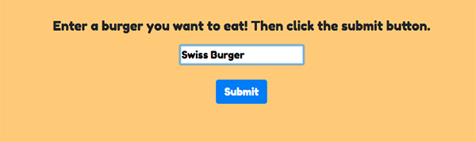
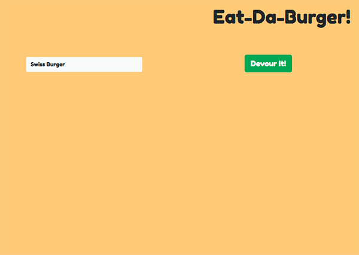
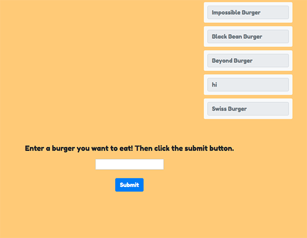

# Eat-Da-Burger

[Eat-Da-Burger](https://murmuring-springs-57128.herokuapp.com/) app utilizing MySQL database and Handlebars to generate html. 

## Description

This Eat-Da Burger app adds burgers to a database by entering a name of a new burger and clicking the submit button. 

The burgers are listed on the left side of the screen along with a button that says "Devour It!". 

When that button is clicked, the burgers is removed from the left side and appears on the right side. 

## Built With

* HTML5
* CSS
* JQuery
* Node
* Express
* MySQL
* Handlebars
* ORM
